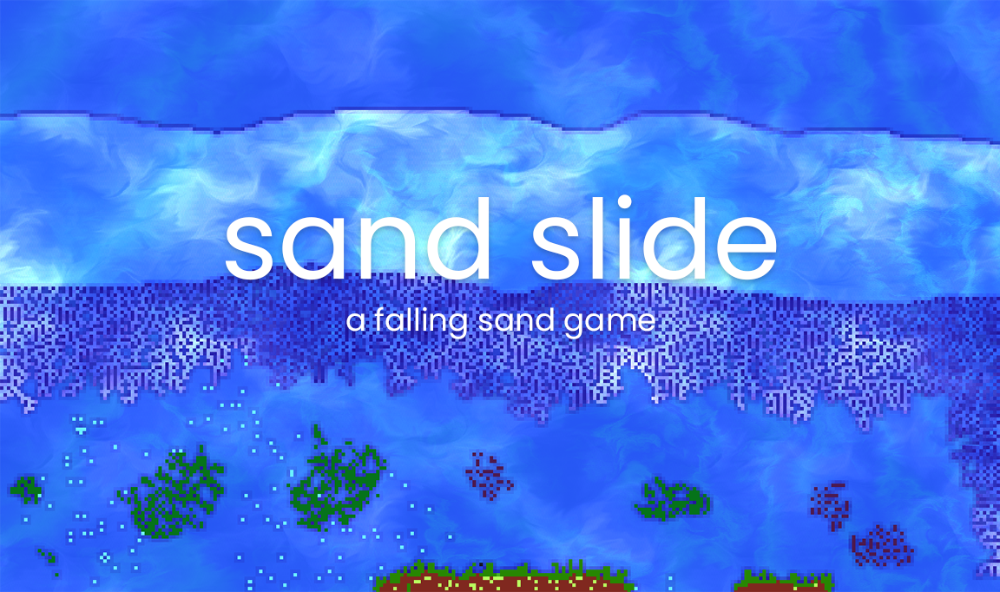

# sand-slide
Prototype falling sand game made with Godot 4 beta 9 and GDextension. The full game can be downloaded for free at the [itch.io page](https://kiwijuice56.itch.io/sand-slide).
This repository is intended to serve as an example of using GDextension in a full project and to allow people to add new elements.




## Project Structure
The GDExtension project was based on another open-source [demo project](https://github.com/paddy-exe/GDExtensionSummator).

The majority of the game is implemented in C++ as a GDextension (in `extension\src`) that gets compiled into a dll file (in `game\bin`). 
The user interface was created in a godot project (in `game`) that calls methods from the GDextension as if it was a node.

## Set Up
1. Clone/download the repository
2. Download the official [godot-cpp repository](https://github.com/godotengine/godot-cpp/tree/1044251a9e85e4c5cb484466c50f6cc309a1bfbe) and place it at the root of the project directory alongside `game` and `extension`. 
Ensure that you install the repository from the link, as compilation will only work if it is synced with Godot 4 beta 3. In addition, make sure that the project
is not open in another window while compiling.
3. In a command prompt at `godot-cpp`, run `scons` (and add `target=template_release` for exported projects). You only need to do this the first time you download the repository.
4. You are now ready to make changes to the project!

## Compiling Changes
Compiling any changes is as simple as opening a command prompt at the root of the project directory and running `scons` (and adding `target=template_release` for exported projects). 
The dll inside of `game\bin` should be updated and require no further steps to run alongside the Godot project. 

## Creating New Elements
Each element is a class within `extension\src\elements` that inherits the `Element` class. 
To create your own element, create a new `.h` file and define a class with the name of your element.
Have your element inherit the `Element` class and implement the virtual methods `process(*SandSimulation sim, int row, inc col)`, `get_explode_resistance()`, and `get_acid_resistance()`. 

`process(*SandSimulation sim, int row, inc col)` contains the main logic for your element. 
It is called each time that the simulation encounters this cell type at `row`, `col`.
Elements have no data or information associated with them, so `process` is essentially a static method that must infer
state from surrounding cells. You can get information and manipulate the simulation by calling methods from the `SandSimulation` pointer. Here is an example for sand:

```cpp
const double FLAME = 1 / 64.0;

void process(SandSimulation *sim, int row, int col) override {
	// randf is a helper method defined within sand_simulation.h that returns a random number [0, 1)
	if (sim->randf() < FLAME && sim->is_on_fire(row, col)) {
		// Set this cell to glass when on fire
		sim->set_cell(row, col, 25); // 25 is the ID of glass, as explained further below
		return;
	}
	// Otherwise, keep falling
	sim->move_and_swap(row, col, row + 1, col);
}
```

More methods helper methods for `SandSimulation` can be found in its header file.

`get_explode_resistance()` and `get_acid_resistance()` must return a float [0, 1] in which 0 is no resistance to explosions/acid and 1 is maximum resistance to explosions/acid.

When you are ready to add your element to the game, import the header file in `extension\src\sand_simulation.h` and add it to the `elements` vector in the constructor. 
The index that you add the element to is its `ID`. Other elements reference this `ID` when checking conditions, such as above where sand
is replaced with glass. Glass is placed at the 25th spot of the `elements` vector, hence its `ID` being 25.

In the godot project, add your element name to the `ELEMENT_INDEX` list within `game\main\main.gd` at the same index you placed it within `elements`. 
The visuals of your element can be modified by creating a resource that extends the `ElementVisual` class and placing it within `game\main\element_visuals\`.
Finally, create a button with the same name that you inserted into the list.

## Save Files
The game allows you to manage save files. Files are stored in `user:\\` which is `%APPDATA%\Godot\app_userdata\Sand Slide` on Windows.
Each folder corresponds to a save file and contains a Godot resource and an image. Each luminosity value in the texture represents an element,
so you can edit the file in an external editor and load it back into the game.

## Attribution
[Plumbing](https://icons8.com/icon/67287/plumbing), [eraser](https://icons8.com/icon/78855/eraser), 
[file](https://icons8.com/icon/77782/file), [settings](https://icons8.com/icon/60006/support) and 
[exit](https://icons8.com/icon/71200/close) icons by [Icons8](https://icons8.com/).

Implementation of Bresenham's Line Algorithm by [Saideep Dicholkar](https://saideepdicholkar.blogspot.com/2017/04/bresenhams-line-algorithm-thick-line.html)

GDExtension Starter Project by [paddy-exe](https://github.com/paddy-exe/GDExtensionSummator)
